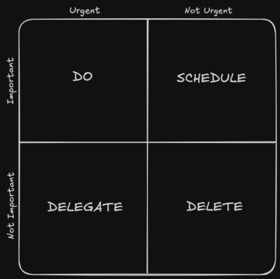

+++
date = '2025-03-03'
description = 'Building on my previous article of Focus Series, considerations to improve focus time quality.'
slug = 'how-to-use-your-focus'
tags = ['published']
title = 'How to use your Focus'
+++

In my previous article, I wrote about [how to focus, and my thoughts on it](./2024-06-21-focus-in-blurred-world.md). But what happens once you manage to focus? How do you use that superpower? (It's a superpower considering the distractions of today).

In this article, I will expand on the techniques you can use to get the most out of the flow moments you achieve. The goal is to be able to use these moments in a way that is truly productive, as Dr. Andrew Huberman mentions in [his podcast](https://share.snipd.com/snip/7f3e7738-a070-4fa9-9ffa-217609953c04).

 > But you shall also ask yourself, are you giving up the best period of focus that you have each day, naturally, to some other thing, like social media or some other activity that doesn't serve you well? -- Andrew Huberman

## Have a concrete focus

The idea of starting a focused moment intentionally is to give a purpose to this action. Imagine you are going to work for an hour in complete solitude; what are you going to work on? Do you want to write X number of pages? Read a whole chapter of your current book? Is there any deliverable that can come out of this task?

Focus is about that, before starting the "ritual" that you created in the previous article, ask yourself what you want to achieve in this block of work. Once you start, the energy should be directed towards doing this task and not towards figuring out what to do.

In the workplace, it is good to take 10 minutes at the end of the day to review what was done, what is pending, and where to invest energy tomorrow. Similarly, in personal life, before going to sleep, make it clear if there is any pending task and prioritize accordingly for the next day.

Lately, I have been increasingly applying this, and although it involves a little more organization compared to just having a to-do list and reviewing it every morning. In my case, since I focus first thing in the morning, it is really beneficial to do it before bed or at the end of the workday.

Another practice that helps to have a concrete task is to use [the pomodoro technique](https://www.todoist.com/productivity-methods/pomodoro-technique), where the timer starts with a particular task in mind. I don't use this for every task, usually having the current task somewhere visible is enough for me; although I am currently trying to do time tracking. But I must say this technique has really helped me whenever I've had difficulties with my attention in general, forcing me to do what I must.

## Avoid Task Switching

With the task already defined, you have to avoid "multitasking" or jumping to other tasks as much as possible. As much as multitasking is glorified, what really happens is that it makes us feel productive because of the satisfaction of feeling busy.

I would dare to say that if a task can be part of a multitasking block, it doesn't deserve to be the focus of our most productive time. Examples of tasks that commonly benefit from multitasking are answering some trivial emails, calls, or half of the household chores.

Writing the draft of this article is a task that I absolutely could not include in a multitasking block. Beyond listening to music, I don't see myself thinking about anything else while I do it, much less talking or writing about any other topic.

Even if it is not done simultaneously, those small distractions are the ones that eventually cause our concentration to break.

## Control your environment & distractions

Eliminating distractions as much as possible also helps with focus. This prevents your brain from fighting the desire of doing other "more entertaining" things (I'll write later about dopamine addiction and my experience transitioning to other media consumption and mindful activities).

The most impactful distraction in our current world is notification. Simply silencing them, or only letting specific people during our focus time improves the result of the work you're doing, allowing you to finish in less time, and even makes act of entering the so-called Flow state easier.

The same goes for what can be controlled in your environment.

In person, letting others know by hanging a sign, or any other system may also improve this if you work from home with people around or in an office setting.

The environment also affects; music with lyrics, having the news or a show as background, also count as distractions.

While these activities might help some people relax during work, they can be detrimental to tasks requiring deep focus, where a single sentence you hear might deviate you from the work at hand.

## Create boundaries and recognize when something doesn't belong

If your focus wavers for a moment it's not going to be the end of the world, but it's important to know how to deal with these scenarios.

When choosing a task to work on, in order to focus you should set the scope for said task, and learn to quickly identify and triage when your attention is going in a different direction.

Let's say you're working on project A, and a coworker comes to your seat with an issue from project B. The process of triage might vary, but in general if it's not urgent and is unrelated to your current task or project A, **write it down**, and let your coworker know you'll get back to them, and you're able to look into the issue.

If you're not sure how to triage, the widespread [Eisenhower Matrix](https://asana.com/resources/eisenhower-matrix) might help you get started.

I highlighted writing it down in the previous section because this way you prevent forgetting about it and are able to sort things out during breaks from the focus work. Also, having a notebook and writing just about anything during your workday is a great practice on its own. I'll share with you more about my experience doing it in a different post.

---

This follow-up post took more time than I expected to be finished. The first two sections were already drafted a few months ago, but I hope it was worth the wait.

There's still a third part to this "Focus Series" I'd like to share in the near future. If it's not out yet, and you want to expand on these topics, feel free to reach me via email or Mastodon.

Once again (or for the first time), thanks for reading.
