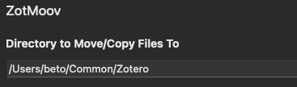
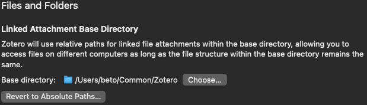
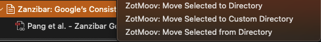

+++
date = '2025-05-23'
description = 'Sharing my current Zotero workflow for reading and annotating PDFs on different devices using Syncthing for syncing.'
slug = 'multi-device-zotero-with-syncthing'
tags = ['published']
title = 'Multi-device Zotero setup with Syncthing'
+++

Recently I've been reading more PDFs than .epub/.mobi e-books, and tired of using my laptop I wanted to use my Kindle Paperwhite PW4. As I turned it on, my KUAL[^1] installation broke, and to be honest I don't want to go through the whole installation process for a 3rd time.

I started looking at different alternatives, leaning towards the Samsung Galaxy Tab S6 Lite, as the S Pen is a nice addition, plus it's better than e-ink for PDFs. I have a Samsung phone and a Macbook, and even with the latest iPad in a close price range I'd prefer going with Samsung again.

A bit pricier than the iPad is the S9 FE, other alternative if I wanted to splurge on this. Anyway, for my use case I've already liked Dex on my phone and can always SSH into one of my machines if I were to do anything else. Let's not forget the hacky Syncthing integration for iPad.

Now back to my e-books/PDFs library, which I had thrown in a Calibre database and let it organize everything, only using it as OPDS catalog. This worked fine with readers, but I want to be able to open highlights, annotations or drawings, using a single copy of the files across devices. I tried it before multiple times without figuring out a workflow I liked.

## Zotero

Enter [Zotero](https://www.zotero.org/), a tool mostly used by academics to organize their citations, with annotation, indexing, tagging, and many more features, that work with PDFs and books. This is great, because some of the PDFs I've been reading are journal articles that don't really fit into my e-book library.

Without much thought, imported my files and most of them were automatically identified and updated with any missing metadata.

Another plus to Zotero is its simplicity in comparison to Calibre. I always felt Calibre too clunky for my likes, hence why I never spent too much time dealing with it.

By default, Zotero copies the imported files to its database directory `~/Zotero` under their own directory with no clear structure, making the directory difficult to navigate without using the Zotero app.

Searching online, Zotfile showed up as the plugin to help me organize the files in a custom directory managed by Zotero, but it seems that it only worked until Zotero 5 (we're at 7). Luckily I found [Zotmoov](https://github.com/wileyyugioh/zotmoov), a similar plugin inspired by Zotfile that does exactly what I needed.

This plugin moves the imported files to the custom directory, renames them, organize them in collection folders and include the attachment as a link to the file.

## Synchronization

With the setup above, the first thing to do is set a custom attachment directory for Zotero to use relative paths and work across devices. Set this to the same directory as the one used in the plugin using the **Directory to Move/Copy Files To** and **Linked Attachment Base Directory**.

If you haven't, select your library items and click **ZotMoov: Move Selected to Directory** to move the files to your synchronization directory.

I'm not going to create a [guide on Syncthing](https://docs.syncthing.net/intro/getting-started.html) but basically all that's left is to set the attachments' directory as a shared directory and connect the other devices. This also works with other synchronization software like Dropbox.

Now you should be able to access all the files in their respective collections directly from your other devices, without even needing to use Zotero.

But what if you want to use the Zotero metadata to navigate, or want to be able to modify it on the go? For this case, you can use the built-in Sync, which uses Zotero server to keep your database in sync. Allowing you to connect with a compatible application and access the files using the attachment path configuration mentioned above.

Since Zotero for Android is in beta and I don't have access, I'm using [Zoo for Zotero](https://github.com/mickstar/Zoo-For-Zotero) with the attachment path set to the sync directory on my phone/tablet. Storage is free for your Zotero database but not for attachments, here we're taking advantage of the *linked* items and their relative paths to circumvent this.

**Last minute update**

Halfway through this article, I found this link by UC Berkeley with more [in-depth guides to Zotero](https://guides.lib.berkeley.edu/zotero). So this whole post may not contribute as much, but still an update on what I've been doing.

**A note on annotations**

Using the Zotero PDF editor to create highlights, annotations, etc., won't update the original PDF file, only include them in the Zotero database. Since I don't have the Zotero for Android app, I've had to open the files with an external editor and make annotations there, so they're reflected in the synced files.

[^1]: I use [KUAL](https://www.mobileread.com/forums/showthread.php?t=203326) to run [KOReader](https://koreader.rocks/) as it adds many features, and it's so much better for PDFs.
