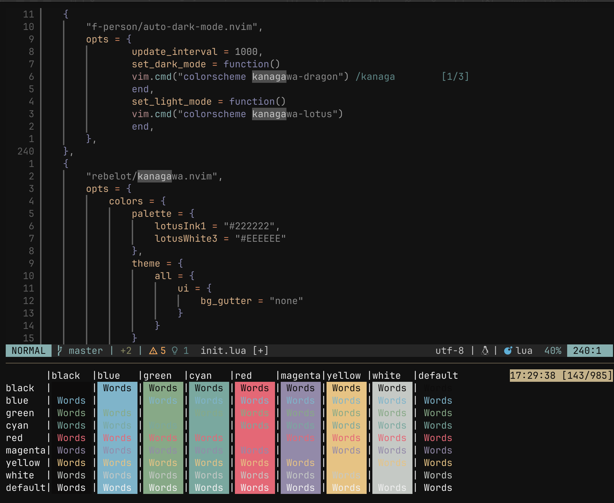
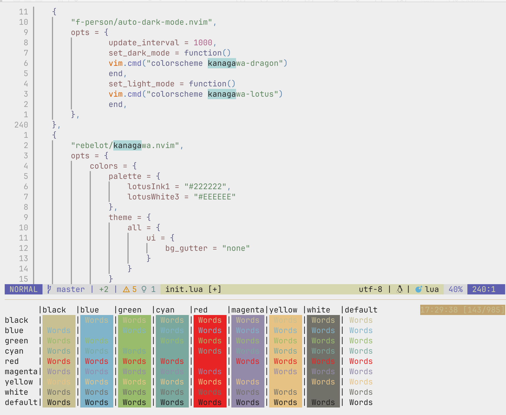

+++
date = '2024-09-12'
slug = '/2024-09-12-terminal-automatic-dark-light-mode'
tags = ['published']
title = 'Automatic dark and light mode for the terminal'
+++

Sometimes I need a refresher for my eyes, not always using a dark screen with light text. This can easily become tiring, specially when reading long texts like books or when the environment is also bright.

I noticed this after switching my smartphone from dark to light mode, something I normally set to dark as soon as I get any device. It was relieving, and the text became clearly more readable. The same happened later when I tried different light themes for Neovim and Wezterm.

Ended up changing my configuration to let both applications identify the mode the system is using, and apply themes accordingly.

The theme I chose was Kanagawa[^1], specifically `dragon` and `lotus` variants. I like having muted colors, otherwise I find them too distracting. I've even thought about switching to other monochrome options, but so far this has been great. The biggest change I made was `lotus`'s background, since I'm not a fan of yellow background since I stopped using Solarized themes.

## Wezterm

For Wezterm, it's already documented how to have different themes based on the system's mode enabled[^2]. The only thing left was adding both dark and light colors, and setting them up.

````lua
local dark_theme = wezterm.color.get_builtin_schemes()['Kanagawa Dragon (Gogh)']
dark_theme.foreground = "#f0f0f0"
dark_theme.background = "#111111"

local light_theme = {
    background = "#EEEEEE",
    foreground = "#222222",

    cursor_bg = "#c8c093",
    cursor_fg = "#c8c093",
    cursor_border = "#c8c093",

    selection_fg = "#c8c093",
    selection_bg = "#2d4f67",

    scrollbar_thumb = "#16161d",
    split = "#16161d",

    ansi = { "#c8c093", "#c34043", "#76946a", "#c0a36e", "#7e9cd8", "#957fb8", "#6a9589", "#090618" },
    brights = { "#dcd7ba", "#e82424", "#98bb6c", "#e6c384", "#7fb4ca", "#938aa9", "#7aa89f", "#727169" },
    indexed = { [16] = "#ffa066", [17] = "#ff5d62" },
}

config.color_schemes = {
    ['Kanagawa Dark'] = dark_theme,
    ['Kanagawa Light'] = light_theme,
}

function get_appearance()
  if wezterm.gui then
    return wezterm.gui.get_appearance()
  end
  return 'Dark'
end

function scheme_for_appearance(appearance)
  if appearance:find 'Dark' then
    return 'Kanagawa Dark'
  else
    return 'Kanagawa Light'
  end
end

config.color_scheme = scheme_for_appearance(get_appearance())
````

## Neovim

The solution here was pretty much two plugins, one for switching the theme[^3], and the theme itself. Good thing the theme plugins allows overriding the colors directly; I still need to override more but I don't think I'll use light mode that often. Below is the configuration using Lazy.

````lua
    {
        "f-person/auto-dark-mode.nvim",
        opts = {
                update_interval = 1000,
                set_dark_mode = function()
                vim.cmd("colorscheme kanagawa-dragon")
                end,
                set_light_mode = function()
                vim.cmd("colorscheme kanagawa-lotus")
                end,
        },
    },
    {
        "rebelot/kanagawa.nvim",
        opts = {
            colors = {
                palette = {
                    lotusInk1 = "#222222",
                    lotusWhite3 = "#EEEEEE"
                },
                theme = {
                    all = {
                        ui = {
                            bg_gutter = "none"
                        }
                    }
                }
            }
        }
    }
````

## Result

**Dark Mode**


**Light Mode**


[^1]: [Kanagawa.nvim](https://github.com/rebelot/kanagawa.nvim)
[^2]: [Wezterm: Automatically switch colors based on system appearance](https://wezfurlong.org/wezterm/config/lua/wezterm.gui/get_appearance.html#wayland-gnome-appearance)
[^3]: [auto-dark-mode.nvim](https://github.com/f-person/auto-dark-mode.nvim)
